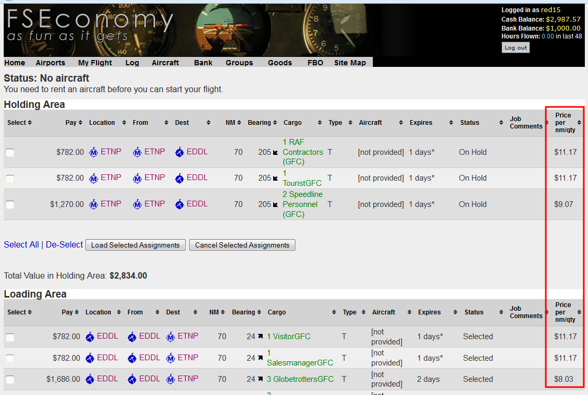
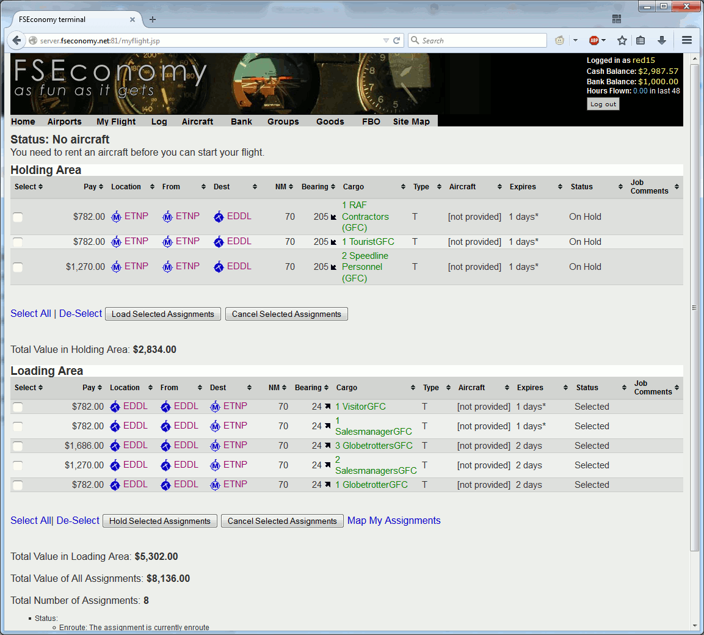
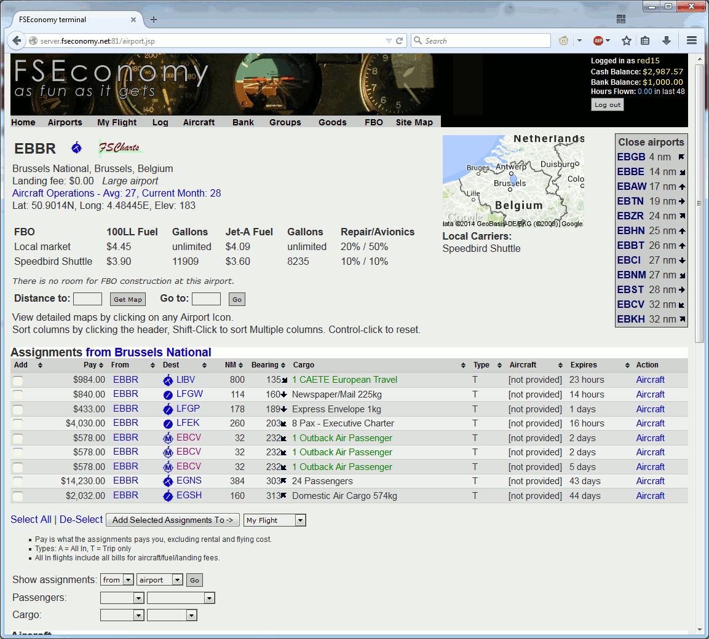

FS Economy: Enhanced
====================

This is a [GreaseMonkey](http://greasespot.net) / [TamperMonkey](http://tampermonkey.net) script for enhancing [FS Economy](http://www.fseconomy.net)

Current Features
================

* Calculate income of passenger flights per NM and per passenger
* Convert cargo into 77kg blocks so the price is comparable to a passenger

Screenshots
===========

